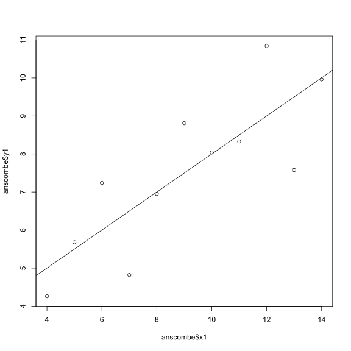
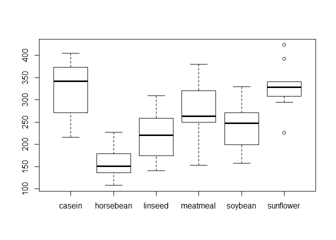

Assignment
================
Ninette Lotter

### Assignment 1

Hello Octocat
-------------

I love Octocat. She's the coolest cat in town.


### Assignment 2

###### Quick look

``` r
# Load data
data("anscombe")
# Dimensions
dim(anscombe)
```

    ## [1] 11  8

``` r
# Column names
names(anscombe)
```

    ## [1] "x1" "x2" "x3" "x4" "y1" "y2" "y3" "y4"

``` r
# First and last 6 lines of data
head(anscombe, n=6)
```

    ##   x1 x2 x3 x4   y1   y2    y3   y4
    ## 1 10 10 10  8 8.04 9.14  7.46 6.58
    ## 2  8  8  8  8 6.95 8.14  6.77 5.76
    ## 3 13 13 13  8 7.58 8.74 12.74 7.71
    ## 4  9  9  9  8 8.81 8.77  7.11 8.84
    ## 5 11 11 11  8 8.33 9.26  7.81 8.47
    ## 6 14 14 14  8 9.96 8.10  8.84 7.04

``` r
tail(anscombe, n=6)
```

    ##    x1 x2 x3 x4    y1   y2   y3    y4
    ## 6  14 14 14  8  9.96 8.10 8.84  7.04
    ## 7   6  6  6  8  7.24 6.13 6.08  5.25
    ## 8   4  4  4 19  4.26 3.10 5.39 12.50
    ## 9  12 12 12  8 10.84 9.13 8.15  5.56
    ## 10  7  7  7  8  4.82 7.26 6.42  7.91
    ## 11  5  5  5  8  5.68 4.74 5.73  6.89

``` r
# Summary statistics
summary(anscombe)
```

    ##        x1             x2             x3             x4    
    ##  Min.   : 4.0   Min.   : 4.0   Min.   : 4.0   Min.   : 8  
    ##  1st Qu.: 6.5   1st Qu.: 6.5   1st Qu.: 6.5   1st Qu.: 8  
    ##  Median : 9.0   Median : 9.0   Median : 9.0   Median : 8  
    ##  Mean   : 9.0   Mean   : 9.0   Mean   : 9.0   Mean   : 9  
    ##  3rd Qu.:11.5   3rd Qu.:11.5   3rd Qu.:11.5   3rd Qu.: 8  
    ##  Max.   :14.0   Max.   :14.0   Max.   :14.0   Max.   :19  
    ##        y1               y2              y3              y4        
    ##  Min.   : 4.260   Min.   :3.100   Min.   : 5.39   Min.   : 5.250  
    ##  1st Qu.: 6.315   1st Qu.:6.695   1st Qu.: 6.25   1st Qu.: 6.170  
    ##  Median : 7.580   Median :8.140   Median : 7.11   Median : 7.040  
    ##  Mean   : 7.501   Mean   :7.501   Mean   : 7.50   Mean   : 7.501  
    ##  3rd Qu.: 8.570   3rd Qu.:8.950   3rd Qu.: 7.98   3rd Qu.: 8.190  
    ##  Max.   :10.840   Max.   :9.260   Max.   :12.74   Max.   :12.500

### Assignment 3

###### XY Plot



### Assignment 4

###### Importing data

``` r
#Use readr package to read data from url and store dataframe into object called 'df'.
df <- readr::read_csv('https://dl.dropboxusercontent.com/u/11805474/painblogr/biostats/assignments/analgesic.csv')
```

###### Summarising a dataset

``` r
# Dimensions 
dim(df)
```

    ## [1] 40  5

``` r
# Names of columns
names(df)
```

    ## [1] "ID"            "Group"         "Measurement_1" "Measurement_2"
    ## [5] "Measurement_3"

``` r
# First and last 6 lines of data
head(df, n=6)
```

    ##   ID     Group Measurement_1 Measurement_2 Measurement_3
    ## 1  1 Analgesic            26            26            21
    ## 2  2 Analgesic            29            26            23
    ## 3  3 Analgesic            24            28            22
    ## 4  4 Analgesic            25            22            24
    ## 5  5 Analgesic            24            28            23
    ## 6  6 Analgesic            22            23            26

``` r
tail(df, n=6)
```

    ##    ID   Group Measurement_1 Measurement_2 Measurement_3
    ## 35 35 Placebo            17            21            15
    ## 36 36 Placebo            19            17            15
    ## 37 37 Placebo            14            19            13
    ## 38 38 Placebo            17            19            13
    ## 39 39 Placebo            11            20            18
    ## 40 40 Placebo            15            18            12

``` r
# Summary statistics
summary(df)
```

    ##        ID           Group           Measurement_1   Measurement_2 
    ##  Min.   : 1.00   Length:40          Min.   :10.00   Min.   : 8.0  
    ##  1st Qu.:10.75   Class :character   1st Qu.:17.00   1st Qu.:17.0  
    ##  Median :20.50   Mode  :character   Median :20.00   Median :20.0  
    ##  Mean   :20.50                      Mean   :20.12   Mean   :20.7  
    ##  3rd Qu.:30.25                      3rd Qu.:24.00   3rd Qu.:25.0  
    ##  Max.   :40.00                      Max.   :30.00   Max.   :32.0  
    ##  Measurement_3  
    ##  Min.   :12.00  
    ##  1st Qu.:16.00  
    ##  Median :20.50  
    ##  Mean   :20.52  
    ##  3rd Qu.:24.25  
    ##  Max.   :30.00

###### Tidying data

``` r
# Load packages
library(tidyr)
library(dplyr)
```

    ## 
    ## Attaching package: 'dplyr'

    ## The following objects are masked from 'package:stats':
    ## 
    ##     filter, lag

    ## The following objects are masked from 'package:base':
    ## 
    ##     intersect, setdiff, setequal, union

``` r
# Tidy data from wide to long format
gathered <- gather(df, key = Measurement, value = Value, Measurement_1:Measurement_3)
# Summarize data by calculating mean across the measurements for each individual
summary <- summarise(group_by(gathered, ID), mean(Value))
# Print final data frame
print(summary)
```

    ## Source: local data frame [40 x 2]
    ## 
    ##       ID mean(Value)
    ##    (int)       (dbl)
    ## 1      1    24.33333
    ## 2      2    26.00000
    ## 3      3    24.66667
    ## 4      4    23.66667
    ## 5      5    25.00000
    ## 6      6    23.66667
    ## 7      7    26.66667
    ## 8      8    23.33333
    ## 9      9    22.66667
    ## 10    10    24.00000
    ## ..   ...         ...

### Chicken weights

**Null hypothesis:** There is no difference in weight of chickens on different feeds.

**Alternative hypothesis:** Different feeds result in differences in chicken weights.

``` r
# Load packages
library(dplyr)
library(tidyr)
# Import data
chicks <- readr::read_csv('https://dl.dropboxusercontent.com/u/11805474/painblogr/biostats/assignments/chick-weights.csv?dl=1')
sum
```

    ## function (..., na.rm = FALSE)  .Primitive("sum")

``` r
# Plot data
boxplot(weight~feed, data = chicks)
```



``` r
# Run statistical test
anova <- aov(weight~feed, data = chicks)
summary(anova)
```

    ##             Df Sum Sq Mean Sq F value   Pr(>F)    
    ## feed         5 231129   46226   15.37 5.94e-10 ***
    ## Residuals   65 195556    3009                     
    ## ---
    ## Signif. codes:  0 '***' 0.001 '**' 0.01 '*' 0.05 '.' 0.1 ' ' 1

``` r
# Perform post-hoc test to correct for multiple comparisons
pairwise.t.test(chicks$weight, chicks$feed, p.adjust.method = 'holm', paired = FALSE)
```

    ## 
    ##  Pairwise comparisons using t tests with pooled SD 
    ## 
    ## data:  chicks$weight and chicks$feed 
    ## 
    ##           casein  horsebean linseed meatmeal soybean
    ## horsebean 2.9e-08 -         -       -        -      
    ## linseed   0.00016 0.09435   -       -        -      
    ## meatmeal  0.18227 9.0e-05   0.09435 -        -      
    ## soybean   0.00532 0.00298   0.51766 0.51766  -      
    ## sunflower 0.81249 1.2e-08   8.1e-05 0.13218  0.00298
    ## 
    ## P value adjustment method: holm

Statistical test: One-way ANOVA Post-hoc test: Holm's multiple comparison test

Assumptions that underlie test:

-   Data are normally distributed.
-   Equal variance across groups.
-   The errors are independent.
-   Data are unmatched.

Test statistic: F-value = 15.37

Degrees of freedom: 5

p value: p &lt; 0.05

**Conclusion:** The different feeds had significant effect on weight of chickens (F = 15.37). The weight of chickens fed casein feed was higher than the weight of chickens fed horsebean (p = 2.9e-08), linseed (p = 0.00016) and soybean (p = 0.00532) feeds. The difference in weight between chickens fed casein feed was not significantly different from the weight of chickens fed meatmeal (p = 0.18227) and sunflower (p = 0.81249) feeds. We can therefore reject the null hypothesis because there are differences in the weight of chickens fed different feeds.

### Hot Zone

**Null hypothesis:** Water consumption has no effect on the prevalence of gastroenteritis.

**Alternative hypothesis:** The prevalence of gastroenteritis is affected by the amount of water consumed.

``` r
library(tidyr)
library(dplyr)
# Import data
hot <- readr::read_csv('https://dl.dropboxusercontent.com/u/11805474/painblogr/biostats/assignments/gastroenteritis.csv?dl=1')
# Explore data
head(hot)
```

    ## Source: local data frame [6 x 2]
    ## 
    ##       Consumption Outcome
    ##             (chr)   (chr)
    ## 1 < 1 glasses/day     ill
    ## 2 < 1 glasses/day     ill
    ## 3 < 1 glasses/day     ill
    ## 4 < 1 glasses/day     ill
    ## 5 < 1 glasses/day     ill
    ## 6 < 1 glasses/day     ill

``` r
tail(hot)
```

    ## Source: local data frame [6 x 2]
    ## 
    ##       Consumption Outcome
    ##             (chr)   (chr)
    ## 1 > 4 glasses/day not ill
    ## 2 > 4 glasses/day not ill
    ## 3 > 4 glasses/day not ill
    ## 4 > 4 glasses/day not ill
    ## 5 > 4 glasses/day not ill
    ## 6 > 4 glasses/day not ill

``` r
# Cross tabulate the data into contingency table
tab <- table(hot$Consumption, hot$Outcome)
# Plot data
barplot(tab, beside = TRUE, legend.text = TRUE, ylim = c(0, 300), col = c('aquamarine', 'blueviolet', 'gold'))
```


``` r
# Statistical test
tab_1 <- tab[-3,]
tab_1p <- fisher.test(tab_1)$p.value
tab_1p
```

    ## [1] 3.636996e-18

``` r
tab_2 <- tab[-2,]
tab_2p <- fisher.test(tab_2)$p.value
tab_2p
```

    ## [1] 2.583564e-09

``` r
tab_3 <- tab[-1,]
tab_3p <- fisher.test(tab_3)$p.value
tab_3p
```

    ## [1] 2.705311e-05

``` r
# Adjust p-values 
p.adjust(c(tab_1p, tab_2p, tab_3p), method = 'holm')
```

    ## [1] 1.091099e-17 5.167128e-09 2.705311e-05

``` r
tab
```

    ##                     
    ##                      ill not ill
    ##   < 1 glasses/day     39     121
    ##   > 4 glasses/day    265     146
    ##   1 to 4 glasses/day 265     258

Statistical test: Fisher's Exact test

Assumptions:

-   Random sampling
-   Observations are independent
-   Large sample, with adequate expected cell counts

p value: p &lt; 0.05

**Conclusion:** The result show that water consumption has a significant effect on disease outcome. The proportion of people who fell ill after consuming less than 1 glass of water per day is significantly different from the proportion of people who fell ill after consuming 1 to 4 glasses per day (p = 5.167e-09) and more than 4 glasses per day (p = 2.705e-05). We can therefore reject the null hypothesis because there is an effect of water consumption on the number of people who fell ill.

### Nausea

**Null hypothesis:** There is no difference in nausea intensity score before and after receiving 5HT3-receptor blocker.

**Alternative hypothesis:** The nausea intensity score is decreased after administration of 5HT3-receptor blocker.

``` r
# Load packages
library(tidyr)
library(dplyr)
library(vcdExtra)
```

    ## Loading required package: vcd

    ## Loading required package: grid

    ## Loading required package: gnm

    ## 
    ## Attaching package: 'vcdExtra'

    ## The following object is masked from 'package:dplyr':
    ## 
    ##     summarise

``` r
# Import data
nausea <- readr::read_csv('https://dl.dropboxusercontent.com/u/11805474/painblogr/biostats/assignments/nausea.csv?dl=1')
# Exclude outlier
nausea_new <- nausea[-8, -1]
# Summarise data
summary(nausea_new)
```

    ##  Nausea_before    Nausea_after  
    ##  Min.   :2.000   Min.   :0.000  
    ##  1st Qu.:2.500   1st Qu.:0.500  
    ##  Median :4.000   Median :1.000  
    ##  Mean   :3.714   Mean   :1.143  
    ##  3rd Qu.:4.500   3rd Qu.:1.500  
    ##  Max.   :6.000   Max.   :3.000

``` r
# Plot data
boxplot(nausea_new)
```


``` r
# Run statistical test
wilcox.test(nausea_new$Nausea_before, nausea_new$Nausea_after, paired = TRUE)
```

    ## 
    ##  Wilcoxon signed rank test with continuity correction
    ## 
    ## data:  nausea_new$Nausea_before and nausea_new$Nausea_after
    ## V = 26, p-value = 0.04983
    ## alternative hypothesis: true location shift is not equal to 0

Statistical test: Wilcoxon signed-rank test

Assumptions for non-parametric tests:

-   The errors are inependent.
-   Samples are drawn from populations with the same shape distributions.
-   Matching is effective.

Test statistic: V = 26

Degrees of freedom: 6

p value: p = 0.04983

**Conclusion:** The median of nausea rating before is 4 while the median for nausea rating after is 1. The Wilcoxon signed-rank test shows that there is a significant effect of group (V = 26, p = 0.04983). We can therefore accept the null hypothesis that there is a difference in nausea intensity rating and, by looking at the data, we confirm that the difference is a decrease in the nausea rating.

### Housing prices

**Null hypothesis:** There is no correlation between interest rate and median house prices.

**Alternative hypothesis:** There is a correlation between interest rate and median house prices.

``` r
# Load packages
library(tidyr)
library(dplyr)
# Load dataset
hp <- readr::read_csv('https://dl.dropboxusercontent.com/u/11805474/painblogr/biostats/assignments/housing-prices.csv?dl=1')
# Exclude NA value row
hp_new <- hp[-17, ]
# Rename columns for easy coding
price <- hp_new$median_house_price_USD
IR <- hp_new$interest_rate
# Linear regression
lin <- lm(price ~ IR, data = hp_new)
# View model
summary(lin)
```

    ## 
    ## Call:
    ## lm(formula = price ~ IR, data = hp_new)
    ## 
    ## Residuals:
    ##    Min     1Q Median     3Q    Max 
    ## -55865 -31631 -16406  27212  80735 
    ## 
    ## Coefficients:
    ##             Estimate Std. Error t value Pr(>|t|)    
    ## (Intercept)   399229      74427   5.364 9.99e-05 ***
    ## IR            -24309       9205  -2.641   0.0194 *  
    ## ---
    ## Signif. codes:  0 '***' 0.001 '**' 0.01 '*' 0.05 '.' 0.1 ' ' 1
    ## 
    ## Residual standard error: 43180 on 14 degrees of freedom
    ## Multiple R-squared:  0.3325, Adjusted R-squared:  0.2848 
    ## F-statistic: 6.974 on 1 and 14 DF,  p-value: 0.01937

``` r
# Exploratory figure
plot(hp_new, main='Correlation between interest rate and median house prices (USD)', xlab='Interest Rate', ylab='Median House Prices (US$)', cex.main=1.1, cex.lab=1, cex.axis=1, fig.width=10, fig.height=10, fig.align='center', cex=1, col='darkorchid')
# Regression line
abline(lm(price ~ IR, data = hp_new))
```


``` r
# Diagnostic plots
plot(x = lin$fitted, y = lin$residuals)
abline(h = 0)
```


``` r
qqnorm(lin$residuals)
qqline(lin$residuals)
```


Statistical test: Linear regression model

Assumptions for linear regression:

-   There is a linear trend between x and y.
-   The observations in the sample are independent.
-   x is measured without error.
-   The residuals are normally distributed.
-   The residuals have the same variance for all fitted values of y (homoskedastic).

Test statistic: F-statistic = 6.974

Degrees of freedom: 14

P-value: p = 0.0194

**Conclusion:** There is a significant correlation (p = 0.019) between interest rate and median house prices. Therefore we can reject the null hypothesis.
